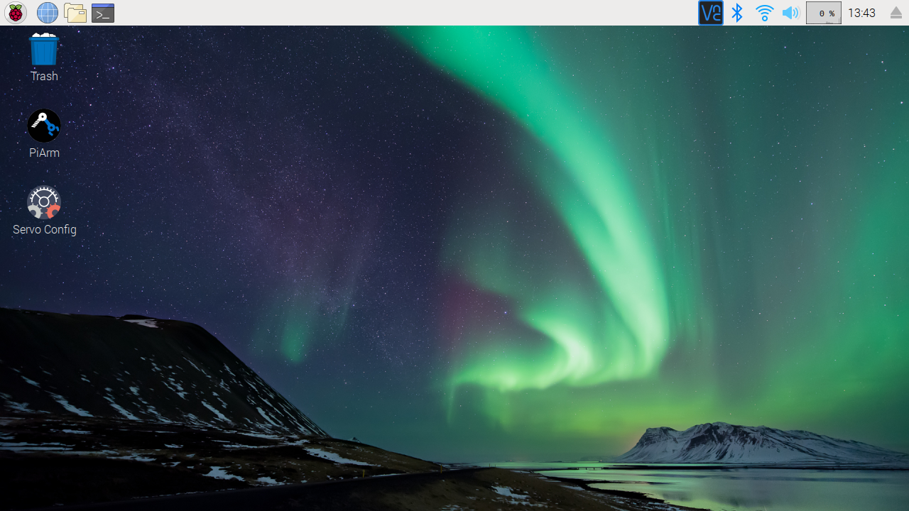
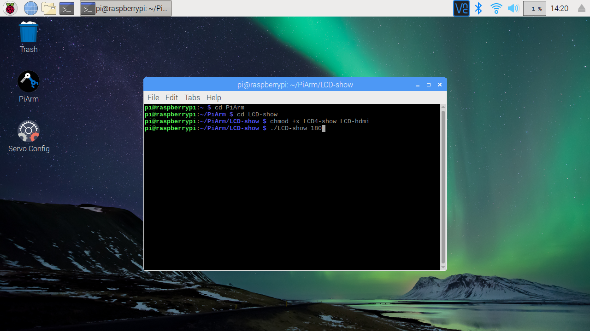

# PiArm

PiArm is a Raspberry Pi based DIY robotic arm outfitted with 6-axis digital computerized servo motors and 360 degrees of rotation liberation designed and developed for kids, makers, and techies.

**Steps for PiArm software installation:**
1. Open Terminal and download the code by writing:

   ```
   git clone https://github.com/sbcshop/PiArm.git
   ```

2. Your code will be downloaded to '/home/pi' directory. Use 'ls' command to check the list of directories.

3. Go to directory 'PiArm' and run the command to change the permissions of 'configGUI' and 'controlGUI' python files:
   ```
   sudo chmod +x configGUI.py controlGUI.py
   ```
   You are now able to run these two softwares for your PiArm. The control software is to control the movements of PiArm, while the config software is to config the servo motor.
   
   Kindly make sure that Serial Communication is enabled and serial console is disabled in the Raspberry Pi configuration.

4. Click on the 'Servo Config' shortcut icon to configure your motor, or if you wish to give movements to PiArm or control it, click on the 'PiArm' shortcut icon.

5. You can also move these 2 icons to your desktop for your convinience.

<p align="center">

</p>

# PiArm with LCD
One of the variants of PiArm has a LCD mounted on its chest. You can configure this screen using few simple steps.

**Steps for LCD configuration**
1. Open terminal and go to the 'LCD-show' directory inside 'PiArm' directory with:
   ```
   cd /PiArm/LCD-show
   ```

2. Run 'lcd_conf.py' file as superuser with display size as first arg and rotation angle as second:

   ```
   sudo python3 lcd_conf.py 7 0
   ```
   Note: Only two display configuration sizes are available 5 and 7 inch and the rotation can be 0, 90, 180, and 270 degree only.
         
After you enter this command, your system will ask you for reboot. Enter 'y' and reboot your Pi.

3. While your system is rebooting, you will have to connect the HDMI and MicroUSB Cable.

Note: In case you see your screen resolutions distorted, you just have to press the on/off button the the LCD screen at its back. This will restore its resolution.

<p align="center">

</p>

# PiArm with ultrsonic
Ultrasonic sensor can be used for PiArm movement on object detection. For using ultrasonic sensor with PiArm follow below steps:

1. Open Terminal and go to the PiArm directory:
   ```
   cd PiArm
   ```
2. Run 'sensor.py':
   ```
   python3 sensor.py
   ```
   Note: Use 'ultrasonic' class for measuring distance, 'example_ultrasonic' class can be used for operating PiArm by changing the commands accordingly.
   
# PiArm Tutorial links


**Servo Config**

<p align="center">
<a href="https://youtu.be/GZJyWnjzaiw" target="_blank"></a></p>


**PiArm Control Software**
<p align="center">
<a href="https://youtu.be/KLsC8npit24" target="_blank">

</a></p>


# Buy Link

SB Shop <a href="https://shop.sb-components.co.uk/products/piarm-the-diy-robotic-arm-for-raspberry-pi" target="_blank">https://shop.sb-components.co.uk/products/piarm-the-diy-robotic-arm-for-raspberry-pi</a>
